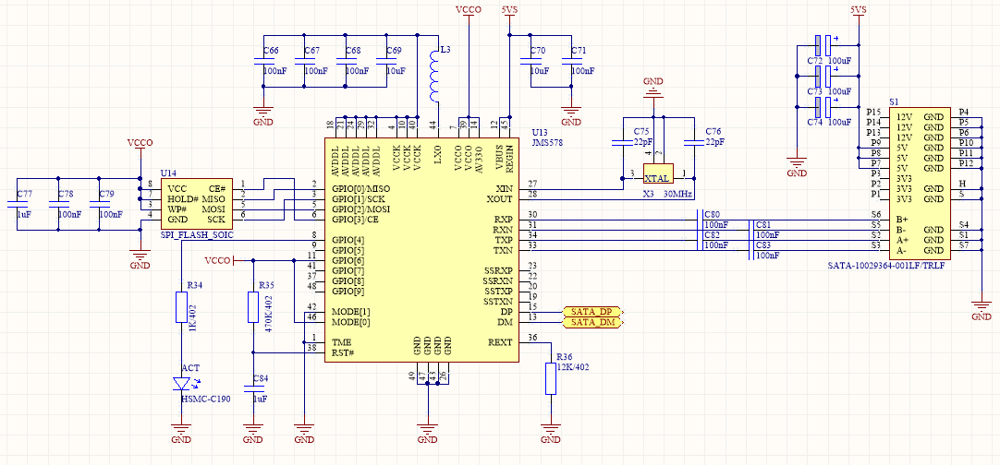

# What is this?
This is a utility to update the firmware of the JMicron JMS578 USB/SATA bridge. It can likely be made to work with other chips with minor modification.

## How to use it
### Dump the BootROM:
The chip has a small internal ROM that normally loads the firmware from flash and starts it. If no valid firmware is found, it connects to the host and presents a zero bytes SCSI device that has a few vendor commands to load the initial firmware.
This utility adds some extra commands to the BootROM to access the flash over DMA. Since the license of this ROM is not known, you will need to dump it yourself. You can then give the dumped file to the extract and flash commands to speed it up massively.

**WARNING: The dumprom command will wipe the flash memory. If you don't have a backup you will brick your device.  If needed, try extracting the firmware first, see the next section.**

You can dump the ROM with the following command:

```./jms578flash -dumprom -unsafe -bootrom /tmp/boot_rom.bin```

You need to dump it only once per chip type.
### Read current firmware:

```./jms578flash -extract -firmware /tmp/fw.bin -bootrom /tmp/boot_rom.bin```

Specifying the bootrom argument will use the dumped ROM to accelerate reading. If you don't have it (yet) or the currently running firmware doesn't allow it to run, you can omit this parameter.
### Write new firmware:
Example command:

```./jms578flash -flash -firmware "JMS578_STD_v00.04.01.04_Self Power + ODD.bin" -bootrom /tmp/boot_rom.bin -unsafe -mods ClearNVRAM```

The bootrom argument is optional and will speed up writing to the flash. The written firmware is verified by reading it back from the memory.
If desired, you can specify one or more mods (comma separated) that will be applied to the firmware image before writing it:

 - *FlashNoWrite*: Change the firmware so it will not try to write the flash. It allows you to use almost any flash chip, as long as the read command is 0x02. In addition, you could hardware write protect the flash chip to guard against BadUSB type attacks.
 - *FlashSupportAT25DN512*: Add support to the firmware for the Adesto AT25DN512. For a little while, during the 2022 chip shortage, this was the only chip easily available.
 - *ClearNVRAM*: Do not use the NVRAM included in the file.
 
By default the utility will add the DMA SPI code to the firmware to be written. This will allow fast SPI access without needing to use the bootrom. If you do not want this, specify: -hook false

## Flash chip support
Unfortunately the commands for SPI flash chips are not standardized. If you get an 'unsupported flash type: 00112233' error, you will need to add the commands for your chip to spiflash/types.go

If you do not know how to do this you can open a ticket for it. Please mention the number on the flash chip used in your device if you know it, sometimes it is not so easy to find the datasheet based on the device ID alone.


## Firmware files

You can download the "JMS578_STD_v00.04.01.04_Self Power + ODD.bin" firmware [here](https://wiki.odroid.com/odroid-xu4/software/jms578_fw_update).

##  Schematic

This schematic shows how you can implement the JMS578 chip in your own designs:

It is one of the cheapest USB<->SATA bridge chips I could find. L3 is a 4.7uH power inductor.
